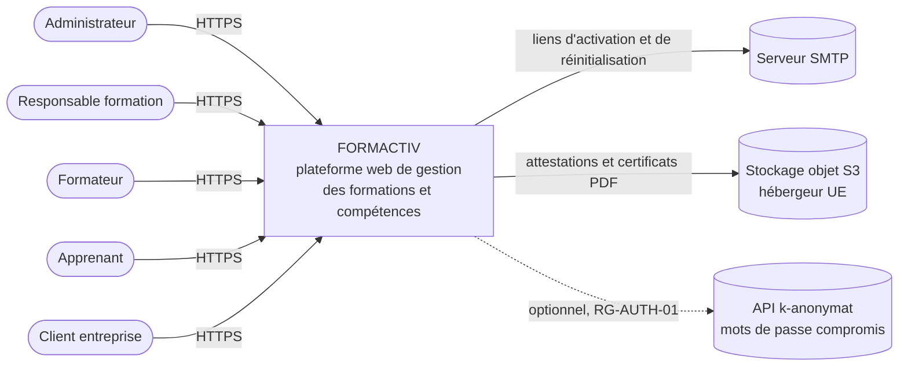
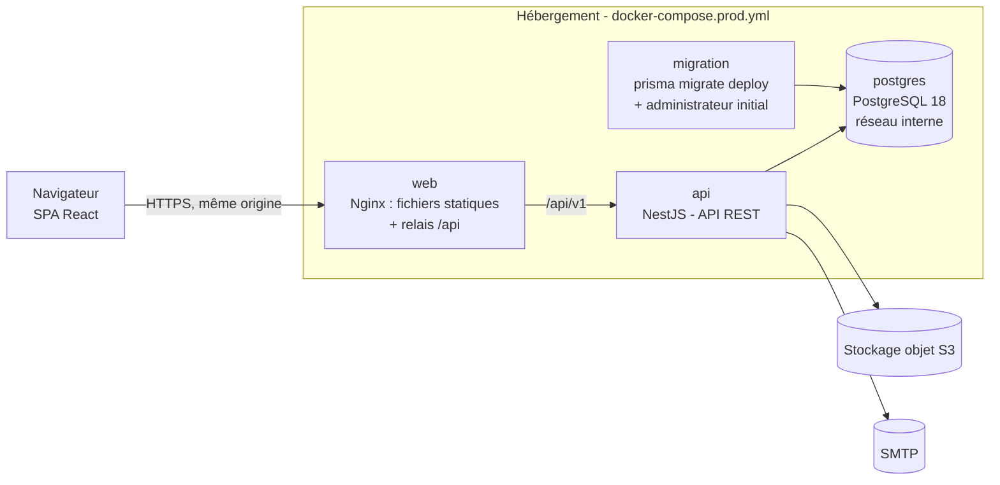
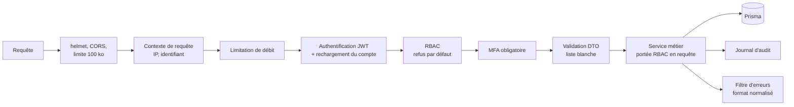
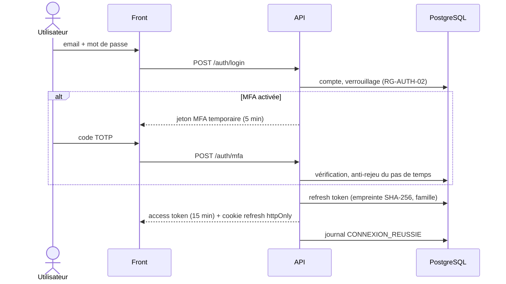
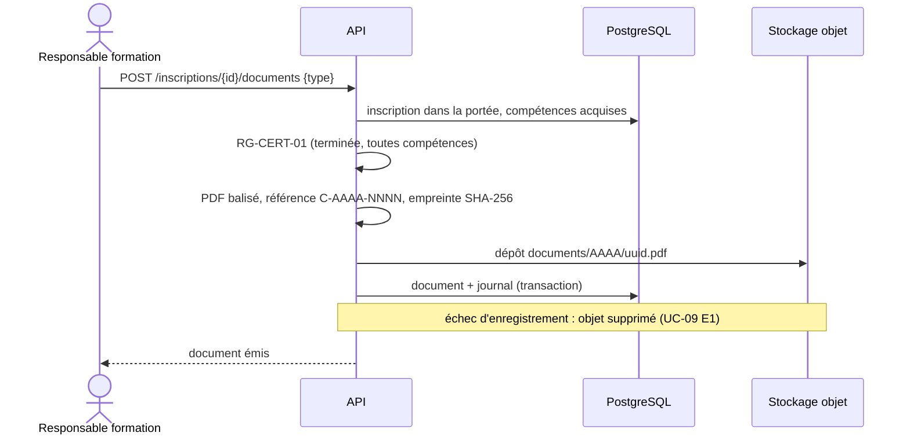

# Architecture de FORMACTIV

Mise en œuvre du chapitre 8 du dossier de conception : application trois tiers, API REST
(ADR-01), monolithe modulaire (ADR-02), PostgreSQL (ADR-03), JWT access/refresh compatible OIDC
(ADR-04), documents en stockage objet (ADR-05). Les décisions sont consignées dans
[`adr/`](adr/).

## Vue d'ensemble

| Couche       | Technologie                                        | Emplacement       |
| ------------ | -------------------------------------------------- | ----------------- |
| Présentation | React 19, Vite 7, React Router 7, TanStack Query 5 | `apps/web`        |
| API          | NestJS 11 (Node 24), REST `/api/v1`, OpenAPI       | `apps/api`        |
| Données      | PostgreSQL 18, Prisma 6 (migrations versionnées)   | `apps/api/prisma` |
| Documents    | Stockage objet S3 (PROD) ou dossier local (DEV)    | ADR-05            |
| Tests E2E    | Playwright, axe-core                               | `e2e`             |

Toutes les règles de gestion et le contrôle d'accès sont appliqués côté API : le front n'est
qu'une commodité d'affichage, jamais une barrière de sécurité.

## C4 — niveau 1 : contexte

## C4 — niveau 2 : conteneurs

Front et API sont servis sur la **même origine** : le cookie du refresh token (`httpOnly`,
`SameSite=Strict`, chemin `/api/v1/auth`) fonctionne sans CORS ; l'access token (15 min) reste
en mémoire du navigateur.

## C4 — niveau 3 : composants de l'API

Un module NestJS par domaine métier, aux frontières étanches (extractibles en service séparé en
V2, REQ-TECH-006) :

| Module          | Responsabilité                                            | Cas d'utilisation |
| --------------- | --------------------------------------------------------- | ----------------- |
| `auth`          | connexion, MFA TOTP, jetons, récupération et activation   | UC-01, UC-02      |
| `utilisateurs`  | comptes, rôle unique, anonymisation                       | UC-03             |
| `entreprises`   | entreprises clientes (SIRET contrôlé)                     | REQ-FUNC-018      |
| `competences`   | référentiels RNCP et interne                              | UC-04             |
| `formations`    | catalogue et cycle de publication                         | UC-04             |
| `sessions`      | planification, affectation des formateurs, conflits       | UC-05, UC-07      |
| `inscriptions`  | inscriptions, capacité, cycle de statuts                  | UC-06             |
| `evaluations`   | notes, acquisition des compétences, feuille de session    | UC-08             |
| `documents`     | attestations et certificats PDF, stockage, parcours       | UC-09, UC-10      |
| `exports`       | exports CSV et PDF limités à la portée du rôle            | UC-11             |
| `reporting`     | indicateurs, tableaux de bord, satisfaction               | UC-12             |
| `rgpd`          | droits des personnes, demandes, politique de conservation | UC-13, UC-14      |
| `journal`       | journal d'audit en écriture seule et consultation         | UC-15             |
| `parametres`    | paramètres plateforme (seuils, durées, MFA obligatoire)   | UC-03             |
| `mail`, `sante` | messagerie, supervision                                   | —                 |

Chaîne de traitement d'une requête :

Les portées de la matrice RBAC (« ses sessions », « son entreprise », « son parcours ») sont
traduites en filtres de requête (`common/auth/portees.ts`) : un objet hors portée n'est jamais
chargé et l'API répond 404 plutôt que 403 (OWASP A01).

## Flux principaux

### Authentification avec MFA (UC-01)

### Génération d'un certificat (UC-09)

## Déploiement cible

`docker-compose.prod.yml` (voir [exploitation](../exploitation.md)) : Nginx seul exposé derrière
le reverse proxy TLS de l'hébergeur, API en système de fichiers en lecture seule avec un
utilisateur non privilégié, base sur un réseau interne, migrations appliquées par une tâche
dédiée à chaque déploiement.

## Sobriété et impact écologique (REQ-NF-005)

- Monolithe modulaire unique : pas d'orchestration ni de trafic réseau interne superflus.
- Front découpé par route (chargement différé), bibliothèques isolées et mises en cache
  longtemps, aucune police ni ressource tierce ; graphiques en SVG natif, sans bibliothèque.
- Pagination systématique des listes, sélection des seules colonnes utiles (Prisma `select`).
- Exports et périodes d'analyse bornés (5 000 inscriptions, trois ans).
- Documents stockés hors base (sauvegardes légères), PDF en polices standard.
